# awtk-widget-plot3d

类似 MATLAB 的三维绘图控件（AWTK 自定义控件）。

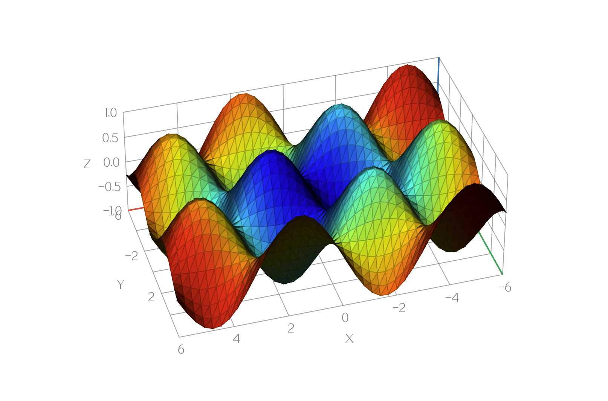

## 功能一览

### 多种呈现方式

| 散点 `dot` | 折线 `line` |
|:---:|:---:|
| 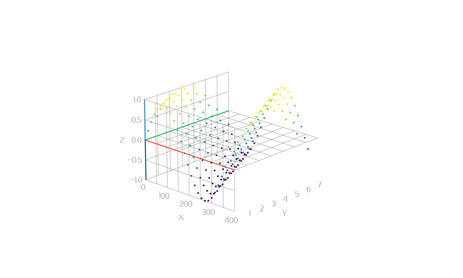 | 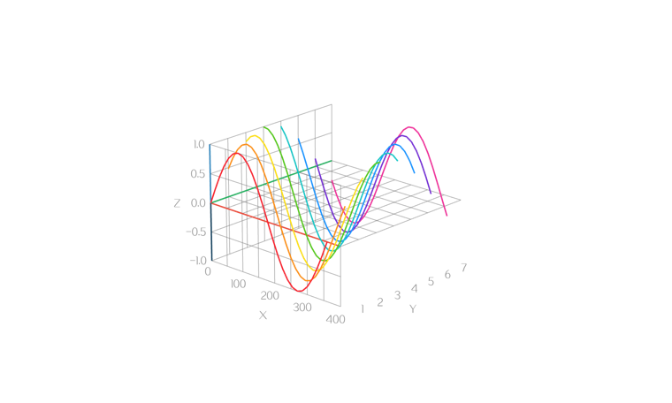 |
| **曲面** `surface` | **柱状** `cylinder` |
|  | 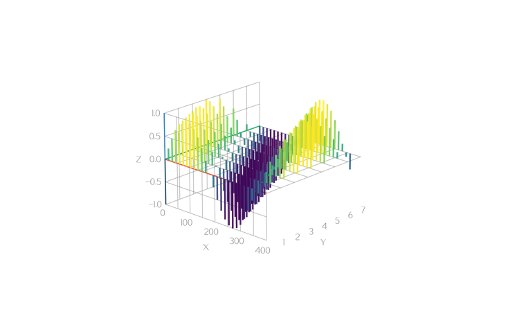 |

- **散点**：看分布与聚类
- **折线**：多段轨迹，空行即分段
- **曲面**：网格三角化 + 明暗
- **柱状**：竖柱落在 z=0，适合相位/频次类数据

### 多种数据来源

| CSV | 网格函数 | 表达式 |
|:---:|:---:|:---:|
| 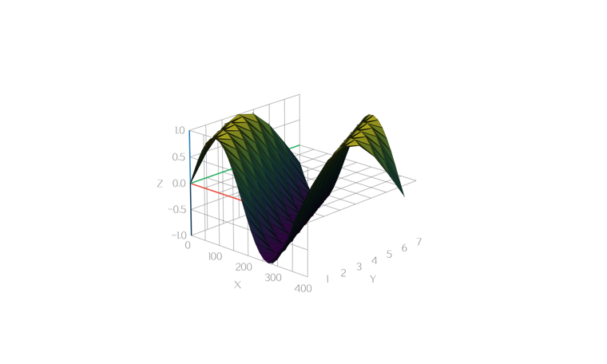 |  | 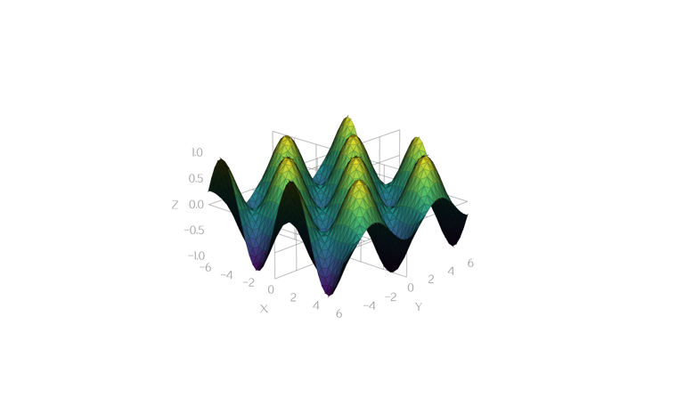 |
| **矩阵** | **参数曲线** | |
|  |  | |

- CSV 文本（`x,y,z,color`）
- `z=f(x,y)` 网格采样（C 回调或表达式）
- 参数曲线按 `t` 走出三维轨迹
- z 矩阵直接喂入

上手示例与代码片段见 [使用指南](docs/usage.md)；格式细则见 [数据格式](docs/data-format.md)。

### 多种 colormap

按高度（或表达式结果）归一化后查表上色，名字与 MATLAB 常用色表对齐：

- **感知/默认**：`viridis`、`parula`、`turbo`
- **经典彩虹**：`jet`、`hsv`
- **温度/灰度系**：`hot`、`cool`、`gray`、`bone`、`pink`、`copper`

也可用表达式按坐标单独上色：

| 按半径 | 分段染色 | 沿曲线参数 `t` |
|:---:|:---:|:---:|
| 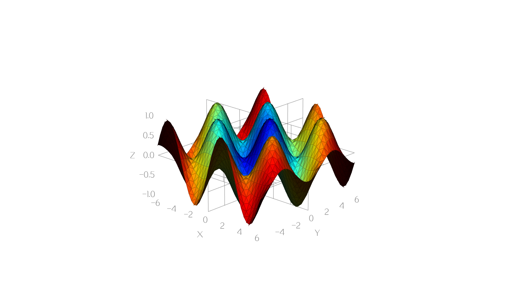 | 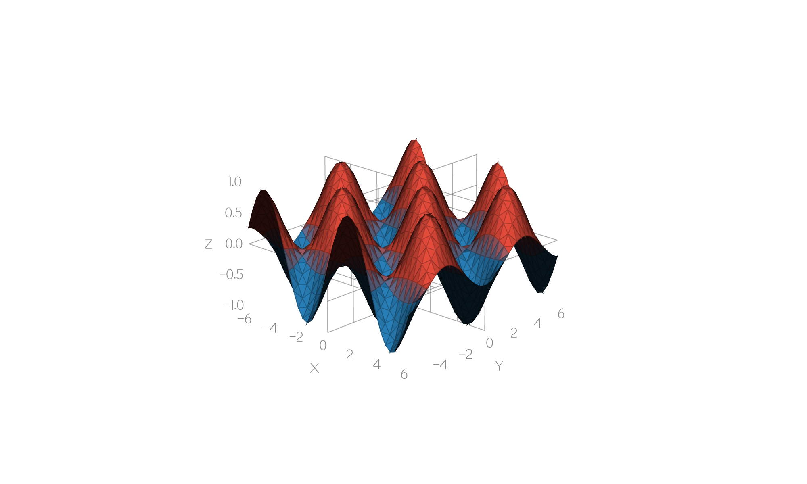 | 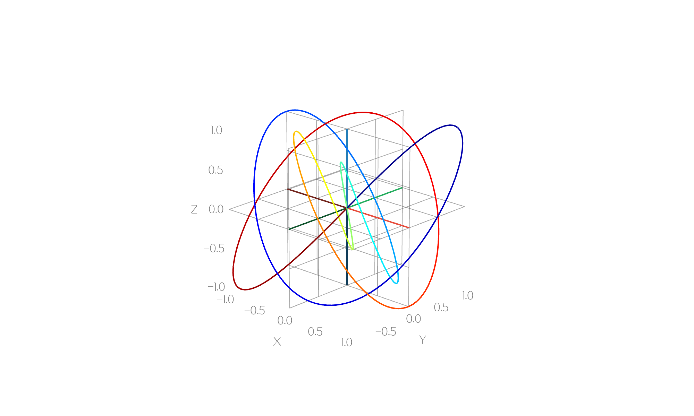 |

用法：属性 `colormap="cool"`，或 `plot3d_set_colormap(w, "cool")`。

### 鼠标悬停读点（DataTip）

类似 MATLAB Data Cursor：鼠标在图上悬停时，吸附最近采样点，显示标记与 (X, Y, Z)。

- 默认开启；属性 `show-datatip="false"` 或 `plot3d_set_show_datatip(w, FALSE)` 可关闭
- 未按下时拾取；拖拽旋转时 tip 自动隐藏
- 吸附阈值约 20px；标签默认在点右上方，贴边时翻到内侧

### 其它特色

- 拖拽旋转，距离与高度可调
- 网格、坐标轴、刻度按需开关与配色
- 等轴或自定义包围盒
- 可选绘制缓存

### 更多样例图

| 阻尼螺旋 | 三叶结 | 矩阵热力 |
|:---:|:---:|:---:|
|  | 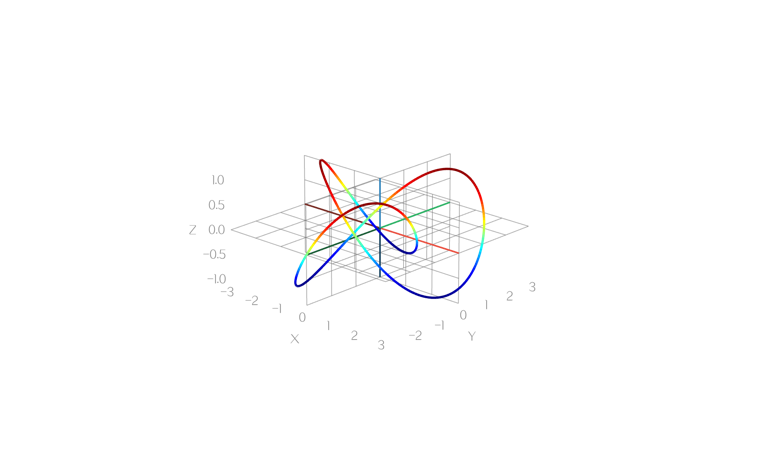 | 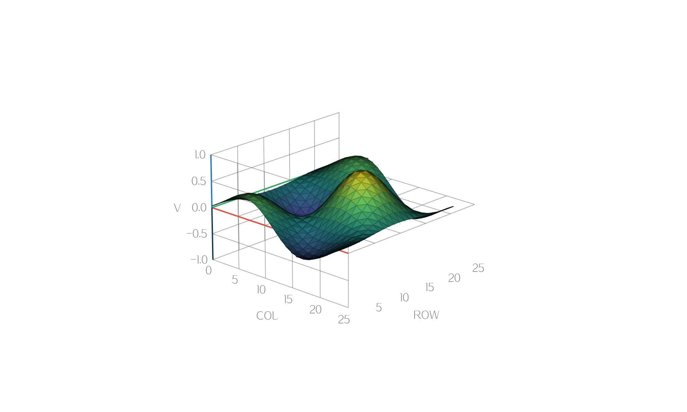 |
| **柱状网格** | **相位柱** | **humps** |
| 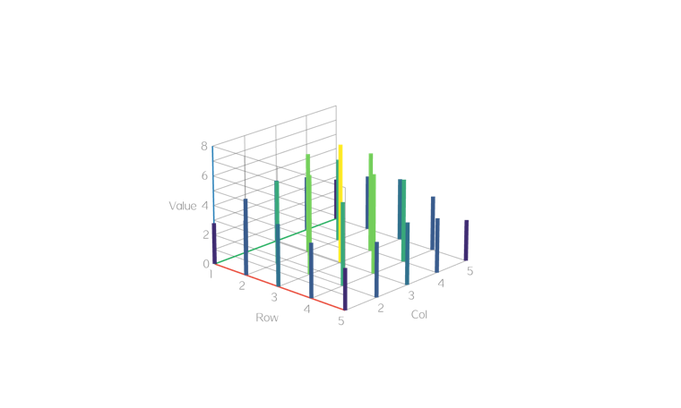 | 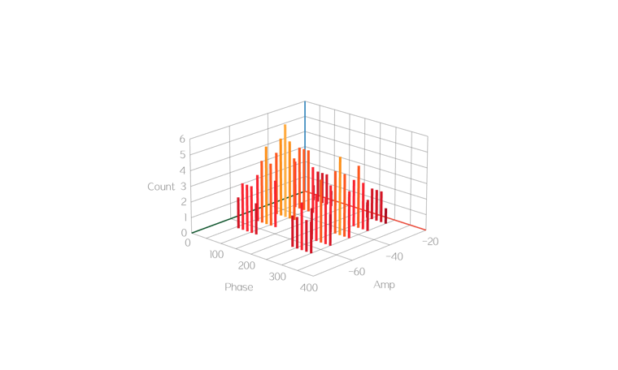 | 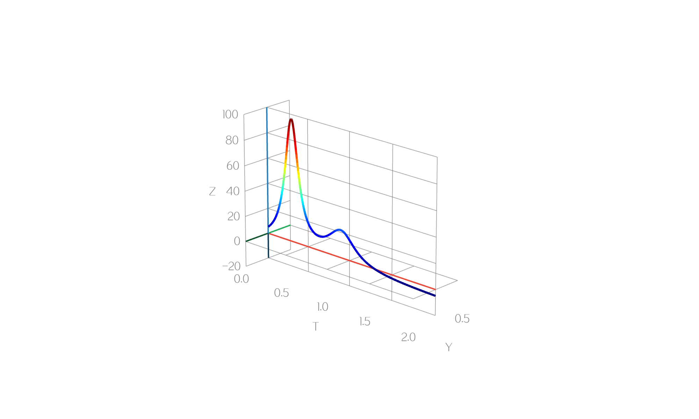 |

开箱示例：完整调参版 `demo_csv` · `demo_grid` · `demo_expr` · `demo_matrix` · `demo_curve`；最简无面板版 `demo_*_min`。

## 准备

1. 获取 awtk 并编译

```
git clone https://github.com/zlgopen/awtk.git
cd awtk; scons; cd -
```

## 运行

1. 生成示例代码的资源

```
python scripts/update_res.py all
```
> 也可以使用 Designer 打开项目，之后点击 “打包” 按钮进行生成；
> 如果资源发生修改，则需要重新生成资源。

如果 PIL 没有安装，执行上述脚本可能会出现如下错误：
```cmd
Traceback (most recent call last):
...
ModuleNotFoundError: No module named 'PIL'
```
请用 pip 安装：
```cmd
pip install Pillow
```

2. 编译

* 编译PC版本

```
scons
```

* 编译LINUX FB版本

```
scons LINUX_FB=true
```

> 完整编译选项请参考[编译选项](https://github.com/zlgopen/awtk-widget-generator/blob/master/docs/build_options.md)

3. 运行

```
# 最简示例（推荐先看）
./bin/demo_csv_min
./bin/demo_grid_min
./bin/demo_expr_min
./bin/demo_matrix_min
./bin/demo_curve_min

# 完整调参示例
./bin/demo_csv
./bin/demo_grid
./bin/demo_expr
./bin/demo_matrix
./bin/demo_curve
```

## 文档

[使用指南](docs/usage.md)（五种数据源最简示例 + 截图，对应 `demo_*_min`）

[数据格式](docs/data-format.md)（行格式、各图形类型的排布要求、用函数与表达式采样、配色、样例数据一览）

[完善自定义控件](https://github.com/zlgopen/awtk-widget-generator/blob/master/docs/improve_generated_widget.md)

## AI 协作

- 仓库级规则：[`AGENTS.md`](AGENTS.md)
- AI 协作文档入口：[`docs/ai/README.md`](docs/ai/README.md)
