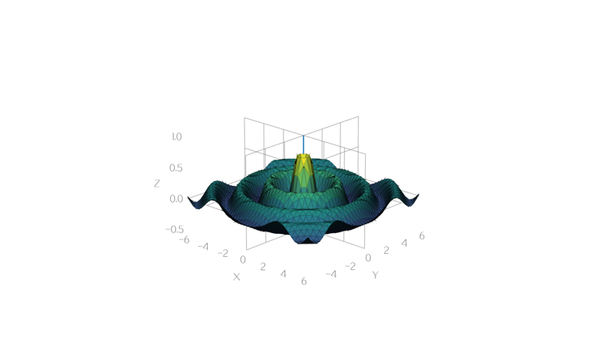
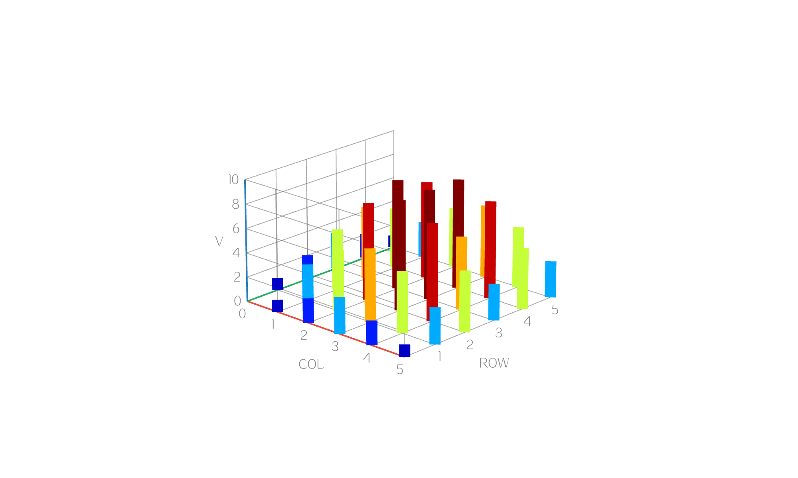
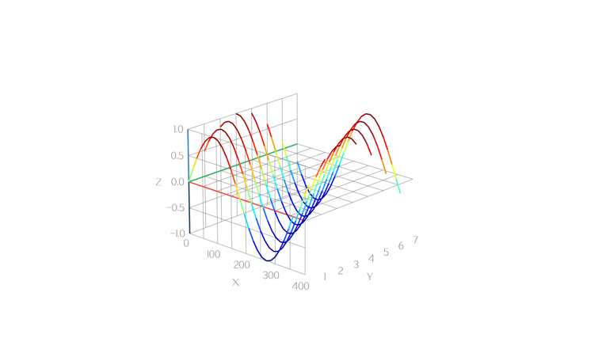

# plot3d 数据格式

数据有两种来源：**CSV 文本**（`dataset` 属性）和**采样函数**（`z = f(x, y)`）。数据点由函数现场算出时不必写 CSV，见[用函数提供数据](#用函数提供数据)。两者互斥，后设置的生效。

plot3d 的 CSV 数据通过 `dataset` 属性传入，内容是**一段 CSV 文本**（不是文件名）。从资源里加载时，先把资源读成字符串再设置：

```c
data = (char*)data_reader_read_all(url, &size);
plot3d_set_dataset(chart, data);
TKMEM_FREE(data);
```

## 行格式

每行描述一个数据点，四个字段用逗号分隔：

```
x,y,z,color
```

| 字段 | 含义 |
|------|------|
| `x` `y` `z` | 数据坐标，浮点数。三个轴各自独立映射到显示空间 |
| `color` | 该点的颜色 |

字段前后的空白会被忽略，`1, 2, 3, #ff0000` 与 `1,2,3,#ff0000` 等价。

`color` 支持 AWTK 的所有颜色写法：`#RRGGBB`、`#RRGGBBAA`、`rgb(r,g,b)`、`rgba(r,g,b,a)` 以及 `red` 这类颜色名。`rgba(...)` 内部的逗号不影响解析。

**空行表示断点**，作用随图形类型不同（见下文）。断点不参与坐标范围计算，不会把坐标轴拉长。

两条硬性约束，违反时不会报错，只会让图变得莫名其妙：

1. **每行必须正好四个字段**。多一个逗号会让整行错位：本想写 `1.9` 却写成 `1,9,0.8,1.2,#f759ab`，会被读成 `x=1, y=9, z=0.8`，颜色失效，y 轴范围也被那个 `9` 拉坏。
2. **不支持注释**。请把说明写在文档里，不要写进 CSV。

## 各图形类型的排布要求

同一批坐标，四种 `plottype` 需要的**点排列方式并不相同**。

### dot

点的先后顺序无关，每个点画一个圆，直径取 `point-size`。空行没有作用。


### line

顺序就是连线顺序，相邻两点连一段，线宽取 `line-width`。**空行断开曲线**，多条曲线之间必须用空行隔开，否则会从上一条的末点直连到下一条的首点。


### surface

每 **3 个点组成一个独立三角形**：第 1~3 行是一个三角形，第 4~6 行是下一个，以此类推，前后三角形不共用顶点。

因此曲面数据不能直接给点序列，必须把网格展开成三角形列表：网格点 `(j,i)`、`(j,i+1)`、`(j+1,i+1)`、`(j+1,i)` 围成的每个四边形展开成两个三角形共 6 行，`R` 行 `C` 列的网格一共 `6 × (R-1) × (C-1)` 行。

每个三角形的颜色取三个顶点颜色的平均值，再按朝向做明暗处理，所以顶点颜色决定整片的色调。


### cylinder

每个点画一根**从 `z` 到 `z=0` 的竖柱**，粗细取 `line-width`。

由于柱子的基准面固定在 `z=0`，当数据的 `z` 全为正（或全为负）时，坐标轴下界会取到最小的 `z` 而不是 0，柱子就会穿出盒子底面。解决办法是补几个**零高度的透明锚点**，把坐标轴锚在 0：

```
0,-80,0,#00000000
360,-80,0,#00000000
0,-20,0,#00000000
360,-20,0,#00000000
```


## 示例

最小可用的数据，三个点连成一条折线：

```
0,0,0,#f5222d
1,0,1,#fa8c16
2,0,0.5,#fadb14
```

多条曲线用空行隔开，同一条用同一个颜色：

```
0,0,0,#1890ff
1,0,1,#1890ff
2,0,0,#1890ff

0,1,0.5,#52c41a
1,1,1.5,#52c41a
2,1,0.5,#52c41a
```

一片 2×2 网格的曲面（4 个网格点 → 1 个四边形 → 2 个三角形 → 6 行）：

```
0,0,0,#21918c
1,0,0.5,#21918c
1,1,1,#5ec962
0,0,0,#21918c
1,1,1,#5ec962
0,1,0.5,#5ec962
```

5×5 的柱状图，柱高映射到颜色，四角补零高度锚点：


局部放电相位分布（PRPD）：相位 0~360 度、幅值 -80~-20 dB、放电次数作为柱高：


## 用函数或矩阵提供数据

数据来自公式、计算或现成的表格时，不必先造 CSV。写成公式或给一个 C 函数，控件按设定的范围与密度自己采样；数据已经是一张 z 表格时，直接把矩阵交给控件。

### 写表达式

表达式是普通属性，能直接写在 XML 里，也能在运行时随时改：

```xml
<plot3d plottype="surface" sample-mode="grid" sample-z-expr="sin(x) * cos(y)"
         sample-x-range="-6,6" sample-y-range="-6,6" sample-steps="40,40" colormap="viridis"/>
```


表达式中 `x`、`y` 是当前格点的坐标，可用 `+ - * / %`、括号，以及下列函数：

| 类别 | 可用函数 |
|------|----------|
| 三角 | `sin` `cos` `tan` `asin` `acos` `atan` `atan2`，以及取角度值的 `sin_deg` 等同名 `_deg` 版本 |
| 幂与对数 | `sqrt` `pow` `exp` `logf` `log10` `pow10` |
| 取整与取值 | `abs` `round` `floor` `ceil` `min` `max` `clamp` |
| 角度换算 | `d2r`（度转弧度）、`r2d` |

写错语法（如 `sin(`）时表达式会被拒绝，图和属性都保持原样，便于一边输入一边看效果；变量名写错（如 `sin(a)`）语法是合法的，该处按 0 计算。

### 写 C 函数

需要读硬件、查表或做复杂计算时，给一个回调：

```c
static ret_t ripple(void* ctx, float_t x, float_t y, float_t* z) {
  float_t r = sqrtf(x * x + y * y);

  *z = sinf(r * 3.0f) / (1.0f + r);

  return RET_OK;
}

plot3d_set_sample_x_range(chart, "-6,6");
plot3d_set_sample_y_range(chart, "-6,6");
plot3d_set_sample_steps(chart, "40,40");
plot3d_set_colormap(chart, "viridis");
plot3d_set_sample_mode(chart, "grid");
plot3d_set_grid_func(chart, ripple, NULL);
```



回调和表达式都设置了时以回调为准，把回调设为 `NULL` 就回到表达式。回调存不进 XML，需要保存到界面文件的场合用表达式。

### 参数曲线

画螺旋、纽结这类曲线时，x、y、z 都由同一个参数 `t` 算出，把 `sample-mode` 设成 `curve`：

```xml
<plot3d plottype="line" sample-mode="curve"
         sample-x-expr="cos(t)" sample-y-expr="sin(t)" sample-z-expr="t / 8"
         sample-t-range="0,25" sample-t-steps="500" colormap="viridis"/>
```


`t` 在 `sample-t-range` 内均匀取 `sample-t-steps` 个值。三个表达式按 x、y、z 的顺序求值，算完的 x 和 y 会写进变量表，所以 `sample-z-expr` 里可以直接引用它们，比如 `"x * y"`。省略 `sample-x-expr` 时 x 取 `t`，省略 `sample-y-expr` 时 y 取 0，因此只写一个 `sample-z-expr` 得到的是 xz 平面上的普通函数曲线。

下面的三叶结把三个方向都写成 `t` 的函数：

```xml
<plot3d plottype="line" sample-mode="curve"
         sample-x-expr="sin(t) + 2 * sin(2 * t)"
         sample-y-expr="cos(t) - 2 * cos(2 * t)"
         sample-z-expr="0 - sin(3 * t)"
         sample-t-range="0,6.283" sample-t-steps="400" colormap="jet"/>
```


曲线采出的是一条连续的点序列，中间不插断点，适合配 `line`、`dot` 或 `cylinder`；`surface` 需要三角形列表，曲线不适用。

示例程序里还带了几条 MATLAB 里常见的曲线，公式可以直接抄用：

| 预设 | x | y | z | t 范围 |
|------|---|---|---|--------|
| `CurveDamped`（阻尼螺旋） | `exp(0 - t / 10) * sin(5 * t)` | `exp(0 - t / 10) * cos(5 * t)` | `t` | -10,10 |
| `CurveSphere`（球面螺旋） | `sin(t) * cos(20 * t)` | `sin(t) * sin(20 * t)` | `cos(t)` | 0,3.1416 |
| `CurveViviani`（Viviani 曲线） | `1 + cos(t)` | `sin(t)` | `2 * sin(t / 2)` | 0,12.566 |
| `CurveHumps`（humps 函数） | 省略 | 省略 | `1 / ((t - 0.3) * (t - 0.3) + 0.01) + 1 / ((t - 0.9) * (t - 0.9) + 0.04) - 6` | 0,2 |


`CurveHumps` 只写了 z，x 取 t、y 取 0，于是得到 xz 平面上的一条普通函数曲线：


要在代码里算坐标（例如坐标来自查表或积分），用回调：

```c
static ret_t knot(void* ctx, float_t t, float_t* x, float_t* y, float_t* z) {
  float_t r = 2 + cosf(3 * t);

  *x = r * cosf(2 * t);
  *y = r * sinf(2 * t);
  *z = sinf(3 * t);

  return RET_OK;
}

plot3d_set_sample_t_range(chart, "0,6.283");
plot3d_set_sample_t_steps(chart, 400);
plot3d_set_sample_mode(chart, "curve");
plot3d_set_curve_func(chart, knot, NULL);
```

### 矩阵输入

数据已经是一张 z 表格（比如温度分布、扫描结果）时，不必转成 CSV，也不必写成公式，把 `sample-mode` 设成 `matrix`，直接把矩阵交给控件：

```xml
<plot3d plottype="cylinder" sample-mode="matrix" colormap="jet"
         sample-z-matrix="0,1,2,3,2,1;1,3,5,6,5,3;2,5,8,9,8,5;3,6,9,9,6,3;2,5,8,9,8,5;1,3,5,6,5,3"/>
```



矩阵按行书写，分号或换行分行，逗号或空格分列，各行列数须相同，否则整个矩阵被拒绝并保持原样。行列数由内容决定，`sample-steps` 在这个模式下不起作用。

x 与 y 默认取列号与行号，如上图的刻度就是 0~5。要换成实际物理量，给出 `sample-x-range` 与 `sample-y-range`，下标会均匀映射到该范围；把范围设为空又回到按下标。

数据量较大或来自设备时用代码给，避免把一大片数字塞进属性：

```c
float_t zs[24 * 24];

/* 按行填好 zs ... */
plot3d_set_sample_mode(chart, "matrix");
plot3d_set_z_matrix(chart, zs, 24, 24);
```


矩阵会拷贝一份保存，调用后即可释放自己的缓冲。属性与 `plot3d_set_z_matrix` 用的是同一份数据，后设置的生效，用代码设置后 `sample-z-matrix` 属性为空。矩阵点的排布与配色都和网格采样一样：`surface` 自动三角化，`line` 每行一条折线，颜色默认按 z 取色。

### 配色

采样点默认按高度配色：把每点的 `z` 在本次采样的最低到最高之间归一化，再到 `colormap`（`viridis`、`jet`、`gray`、`parula`、`hot`、`cool`、`hsv`、`bone`、`copper`、`pink`、`turbo`）上取色。

想按别的量配色，写 `sample-color-expr`，变量是该点的 `x`、`y`、`z`（曲线还有 `t`）。表达式**算出数值**时，这个值取代 `z` 参与归一化，颜色仍来自配色表。下图按到原点的距离配色，同样高度的几个波峰颜色各不相同：

```xml
<plot3d plottype="surface" sample-mode="grid" sample-z-expr="sin(x) * cos(y)"
         sample-color-expr="sqrt(x * x + y * y)"
         sample-x-range="-6,6" sample-y-range="-6,6" sample-steps="40,40" colormap="jet"/>
```


表达式**算出颜色字符串**时直接用这个颜色，配色表不再参与，配合 `if` 可以分段着色：

```xml
<plot3d plottype="surface" sample-mode="grid" sample-z-expr="sin(x) * cos(y)"
         sample-color-expr="if(z > 0, &quot;#e74c3c&quot;, &quot;#2980b9&quot;)"
         sample-x-range="-6,6" sample-y-range="-6,6" sample-steps="36,36"/>
```


曲线上按 `t` 配色，颜色就顺着走向渐变，而不是跟着高度反复变化：

```xml
<plot3d plottype="line" sample-mode="curve"
         sample-x-expr="sin(3 * t)" sample-y-expr="sin(4 * t)" sample-z-expr="sin(5 * t)"
         sample-color-expr="t" sample-t-range="0,6.283" sample-t-steps="600" colormap="jet"/>
```


配色表达式留空就回到按 `z` 取色。要在代码里算颜色，用回调：

```c
static ret_t split_color(void* ctx, float_t x, float_t y, float_t z, color_t* color) {
  *color = z > 0 ? color_init(0xe7, 0x4c, 0x3c, 0xff) : color_init(0x29, 0x80, 0xb9, 0xff);

  return RET_OK;
}

plot3d_set_color_func(chart, split_color, NULL);
```

回调和配色表达式都设置了时以回调为准，把回调设为 `NULL` 就回到表达式。配色只作用于函数采样，CSV 数据的颜色写在文件里。

### 采样属性

| 属性 | 含义 |
|------|------|
| `sample-mode` | `none` 用 `dataset` 的 CSV，`grid` 按格点采样，`curve` 按参数 `t` 采样曲线，`matrix` 用现成的 z 矩阵 |
| `sample-z-expr` | `z` 的表达式：`grid` 模式变量为 `x` 与 `y`，`curve` 模式变量为 `t` |
| `sample-x-expr` `sample-y-expr` | 仅 `curve` 模式：x 与 y 的表达式，变量为 `t` |
| `sample-z-matrix` | 仅 `matrix` 模式：z 矩阵，如 `"1,2;3,4"`，分号或换行分行 |
| `sample-x-range` `sample-y-range` | `grid` 与 `matrix` 模式的采样范围，写成 `"min,max"`，顺序写反也按小到大处理；为空时 `grid` 按 0~1、`matrix` 按下标 |
| `sample-steps` | 仅 `grid` 模式：格点数，写成 `"cols,rows"`；只写一个数时两个方向相同；取值范围 2~100 |
| `sample-t-range` | 仅 `curve` 模式：`t` 的范围，如 `"0,6.28"` |
| `sample-t-steps` | 仅 `curve` 模式：曲线点数，取值范围 2~10000 |
| `sample-color-expr` | 配色表达式，变量为 `x`、`y`、`z`（`curve` 模式还有 `t`）；结果为数值时按该值取色，为颜色字符串时直接用该颜色；留空按 `z` 取色 |
| `colormap` | 配色表：`viridis`、`jet`、`gray`、`parula`、`hot`、`cool`、`hsv`、`bone`、`copper`、`pink`、`turbo` |

各模式的数据与参数各自独立，来回切换不会互相干扰。采样数据与 `dataset` 的 CSV 互斥：设了 `dataset` 就回到 `none` 模式，改回 `grid`、`curve` 或 `matrix` 又用采样结果。

采样点均匀分布且**包含两端**：`sample-x-range="0,3"` 配 `sample-steps="4,2"`，x 取 0、1、2、3。改范围、密度、配色表或图形类型都会立即重新采样。

采样点会**按 `plottype` 自动排布**，所以不用关心上文各类型的排列要求：

| 类型 | 排布 |
|------|------|
| `dot` / `cylinder` | 逐个格点铺开 |
| `line` | 每行一条折线，行之间自动断开 |
| `surface` | 自动三角化，无需手工展开成三角形列表 |

下图是把行进波 `z = sin(x + 0.5y)` 交给函数采样的结果，与 CSV 版 `sample_sin_line` 的几何完全一致，区别只是配色由高度决定而不是每条曲线一色：



示例程序里可以直接试：

| 入口 | 内容 |
|------|------|
| `Preset` 下拉框 | `Expr*` 是网格表达式，`Curve*` 是参数曲线，`Color*` 是配色表达式，`Matrix*` 是矩阵输入，`FuncRipple`、`FuncSinLine` 是 C 函数采样，其余是 CSV |
| `Func` 下拉框 | 换采样源；选 `None` 回到 CSV |
| `z =` 输入框 | 写自己的公式后点 `Apply`；切到 `Expr*` 或 `Curve*` 预设时公式会回填到这里，可以接着改。曲线模式下只替换 z，仍是曲线 |
| `color =` 输入框 | 配色公式，同样点 `Apply` 生效；清空就回到按高度配色 |
| `Step±` `Rng±` | 改密度与范围：网格模式作用于格点数与 x/y 范围，曲线模式作用于点数与 `t` 范围 |

右侧状态栏显示当前模式、数据来自 `expr`、`func` 还是矩阵（`text` 表示写在属性里、`data` 表示由代码给）、密度、点数，以及配色表名字（配色交给表达式时显示 `colorexpr`）。两个公式可以拿来当例子：`ExprRose` 的 `cos(3 * atan2(y, x)) * exp(0 - sqrt(x * x + y * y) / 4)` 说明用 `atan2` 就能在直角格点上画极坐标图形；`CurveHelix` 里把 z 改成 `sin(3 * t)`，螺旋立刻变成沿圆周起伏的波浪环。

## 自带样例数据

| 文件 | 适用类型 | 点数 | 内容 |
|------|----------|------|------|
| `sample_sin_dot` | dot | 200 | `z = sin(x + 0.5y)` 行进波，8 条 y × 25 点 |
| `sample_sin_line` | line | 200 | 同上，按条空行隔开、每条一色 |
| `sample_sin_cylinder` | cylinder | 200 | 同上，柱状 |
| `sample_sin_surface` | surface | 1008 | 同上，三角形列表 |
| `sample_peaks` | surface | 1944 | MATLAB peaks 山峰地形，19×19 网格 |
| `sample_sombrero` | surface | 1944 | 墨西哥帽 `sin(r)/r`，19×19 网格 |
| `sample_lorenz` | line | 2000 | 洛伦兹吸引子 |
| `sample_helix` | line | 268 | 双螺旋 DNA，两条链 + 13 根横档 |
| `sample_sphere` | dot | 300 | 球面斐波那契点云 |
| `sample_bars` | cylinder | 29 | 5×5 柱阵 + 4 个零高度锚点 |
| `sample_trefoil` | line | 241 | 三叶结闭合曲线 |
| `sample_pd` | cylinder | 54 | 局部放电相位分布 |
| `sample_dot` / `sample_line` / `sample_surface` / `sample_cylinder` | 各自 | 少量 | 最小样例 |

文件都在 `design/default/data/` 下。颜色规则：dot/surface/cylinder 按 `z` 高度取 viridis 渐变，line 按曲线分色。

在示例程序里从 `Preset` 下拉框即可选中它们，预设会同时配好图形类型、轴名、网格数、盒子比例和点线粗细。

想改数据密度、换公式或加新图形，改 `scripts/gen_sample_data.py` 后重新生成并打包资源：

```
python scripts/gen_sample_data.py
python scripts/update_res.py all
```

## 插件注册与裁剪

取数方式（csv / grid / curve / matrix）与表达式配色已拆成可独立注册的插件。图型插件已迁移 `dot` / `line` / `surface` / `cylinder` 四种实现，核心保留排序与上屏流程。

### `plot3d_register()` 与 `plot3d_register_all()`

| 入口 | 作用 |
|------|------|
| `plot3d_register()` | 只向 `widget_factory` 注册控件类型，**不**注册任何数据源 / 配色 / 图型插件 |
| `plot3d_register_all()` | 先调 `plot3d_register()`，再注册全部内置插件（csv、matrix、curve、grid、expr colorizer、dot/line/surface/cylinder type） |
| `plot3d_unregister()` | 清空三类插件工厂并反注册控件类型 |

示例与单元测试默认走 `plot3d_register_all()`。嵌入式或定制产品若只需部分能力，应改用 `plot3d_register()` 再按需手工注册。

### 按需注册

```c
plot3d_register();
plot3d_source_matrix_register();
/* 需要表达式配色时再加：plot3d_colorizer_expr_register(); */
```

裁剪场景下，未注册数据源对应的 `sample-mode` 会返回 `RET_NOT_FOUND`（见测试
`Plot3dSourceFactoryTest.unregistered_source_mode_returns_not_found`）。`"none"` 豁免注册表检查：即使裁掉 csv 插件，仍可切回 `none`，只是不产生数据点。`plot3d_set_dataset` 直写 mode 的路径不受注册表检查影响。

图型裁剪行为：`plot3d_set_plottype(...)` 以控件上的图型实例为准。未注册、或已注册但当前控件无对应实例时，均返回 `RET_NOT_FOUND`（不再维护硬编码白名单，也不再回退到核心图型分支）。`point_size` / `line_width` 由各图型插件持有；裁掉全部图型插件后设置这两个属性返回 `RET_BAD_PARAMS`。

### 裁剪时同步改两处

要从二进制里拿掉某插件，必须同时：

1. 从 `src/SConscript` 的 `SOURCE_PLUGINS` / `COLORIZER_PLUGINS` 显式清单中删除对应 `.c`（不要再对插件目录 `Glob`）。
2. 从 `plot3d_register_all()` 中去掉对应的 `*_register()` 调用；或改用不调用该行的按需注册写法。

只改一处会导致链接失败或运行时仍引用已删符号。

### 体积对照（macOS Debug，`bin/libplot3d.dylib`）

在本仓库 macOS Debug 构建下实测（`-g -O0`，产物不被 git 跟踪，数字仅供对照）：

| 配置 | 体积 |
|------|------|
| 全量（4 数据源 + expr colorizer） | 204352 字节（约 199.6 KiB） |
| 最小（仅 factory + matrix + colorizer factory） | 179872 字节（约 175.7 KiB） |
| 差额 | 24480 字节（约 23.9 KiB） |

最小配置：`SOURCE_PLUGINS` 只留 `plot3d_source.c` 与 `plot3d_source_matrix.c`，`COLORIZER_PLUGINS` 只留 `plot3d_colorizer.c`，并注释掉 `register_all` 中 csv / grid / curve / expr 的注册行。验证后应恢复全量。

### 预期退化（不是 bug）

裁成上述最小配置时：

- csv / grid / curve 示例无数据；切到这三种 `sample-mode` 得 `RET_NOT_FOUND`
- 表达式配色不可用，一律按 `z` 查 `colormap`
- `"none"` 仍可切入，但不产生点

### 设计器属性面板的已知限制

结构体 `@property` 已随字段迁到插件后，IDL / design 面板可能不再列出部分 `sample-*` 属性。clone 与持久化仍依赖核心的 `s_plot3d_properties[]` 属性名总表，运行时 get/set 经广播到达插件。若设计器要在面板中编辑这些属性，需另补暴露机制——本期不做。
